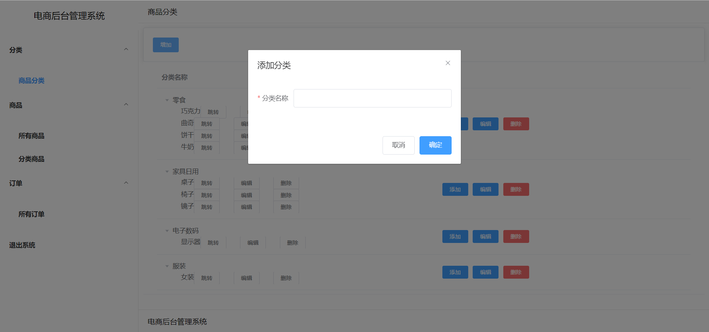

## 电商后台管理系统

该项目是一个`简易电商后台管理系统`, 使用的技术如下

前端: vue3 + Typescript + vite + axios + element plus

后端: springboot + mybatis + mysql

## 系统整体设计


## 前端实现

### 布局

界面使用了 `flex 布局`, 左侧宽度`300px`, 右侧内容`自适应`

```css
.aside {
  width: 300px !important;
}

.main_content {
  display: flex;
  width: 100%;
}
```

### 动态读取路由

左侧菜单读取为动态写法, 通过 `v-for` , 遍历读取所有的路由, 当添加, 删除路由时, 不用手动修改

```html
<el-menu
  class="el_menu"
  :router="true"
  :default-openeds="defaultOpen"
  :default-active="$route.path"
>
  <template v-for="(menu, index) in allRouteSrc">
    <el-sub-menu :index="index.toString()">
      <template #title>
        <span style="font-weight: bold;">{{ menu.meta!.title }}</span>
      </template>
      <el-menu-item-group>
        <template v-for="item in menu.children">
          <el-menu-item :index="item.path">
            <span style="font-weight: bold;">{{ item.meta!.title }}</span>
          </el-menu-item>
        </template>
      </el-menu-item-group>
    </el-sub-menu>
  </template>
</el-menu>
```

### 表单设计

将`form表单`提取到一个`单独的组件中`,在父组件中通过如下方式引入, 提高了**可复用性**

```js
const goodsDialog = defineAsyncComponent(() => import('./goodsDialog.vue'))
```

动态引入,实现了按需加载的效果,也就说当你操作组件的时候,组件才会加载,提高了首屏加载的时间

---

另外,将表格中`上层标签，表单类型，校验规则`等**动态属性**抽取到单独 `attr.ts 文件`中, 使得代码中只需要通过 `v-for` 遍历 `attr.ts 文件下的属性`,如果以后需要添加新的属性,**直接修改`attr.ts`下对应的数据结构**即可,不需要更改默认渲染到页面上的代码,使得**代码逻辑清晰**, 提高了代码的可读性, 可维护性

```js
import { operation } from './attr.ts'
```

通过在 `template 中`使用 `v-if` 动态渲染对应内容

```html
<el-form :model="formModel" :rules="formRules" ref="formRef" label-width="100px">
  <el-form-item v-for="option in operation" :label="option.label" :prop="option.prop">
    <template v-if="option.operate === 'input'">
      <template v-if="option.type === 'number'">
        <el-input v-model.number="formModel[option.prop]"></el-input>
      </template>
      <template v-else>
        <el-input v-model="formModel[option.prop]"></el-input>
      </template>
    </template>
    <template v-if="option.operate === 'select'">
      <el-select v-model="formModel[option.prop]" style="width:100%" placeholder=" ">
        <el-option v-for="o in categoryData" :label="o.categoryName" :value="o.id"></el-option>
      </el-select>
    </template>
  </el-form-item>
</el-form>
```

### 请求接口设计

`接口的封装`使用到了`单例模式`, 在`JavaScript`, 实现单例模式非常容易, 只需要**导出一个默认的实例**就行

```js
import axios, { AxiosRequestConfig } from 'axios'
class HttpRequest {
  getInsideConfig() {
    const config = {
      headers: {}
    }
    return config
  }
  req(options: AxiosRequestConfig<any>) {
    const instance = axios.create()
    options = Object.assign(this.getInsideConfig(), options)
    // this.interceptors(instance, options.url)
    return instance(options)
  }
}
export default new HttpRequest()
```

具体的使用大致如下格式

```js
import axios from '@/libs/axios'
import Api from '@/api/base/api-config'
const baseApi = Api.goodsBack.goodsCategory
export const getAllGoodsCategoryListApi = () => {
  const url = baseApi.concat('/getAllGoodsCategoryList')
  return axios.req({
    method: 'get',
    url: url
  })
}
```

### 界面展示

商品分类管理


可进行一级分类, 二级分类的添加



可以修改每页表格中所展示数据的多少


进行表单操作的时候, 会进行校验, 校验成功, 才允许发送请求


能够对商品进行模糊查询


根据上方的下拉框, 显示属于选中类别的所有商品


可添加订单


## 数据库实现


`订单表`与`商品表`相关联, 通过 `goods_id字段`,可获取该订单所对应的`商品名称`

`商品表`与`分类表`相关联, 通过 `goods_type 字段`, 可获取该`商品所属的类别名称`

在`分类表`中, `parent_id 字段`表示该类别的`父级类别`

## 后端实现

### 搭建 springboot 项目

通过`idea`创建`springboot项目`


### 连接数据库

`MyBatis-Spring-Boot-Starter` 可以帮助开发者快速创建基于 `Spring Boot` 的 `MyBatis 应用程序`

在 `pom 文件中`引入 `spring-boot-starter-jdbc` 依赖

```xml
dependency>
    <groupId>org.mybatis.spring.boot</groupId>
    <artifactId>mybatis-spring-boot-starter</artifactId>
    <version>2.1.3</version>
</dependency>
```

在`application.properties文件下`配置连接数据库的信息

```properties
spring.datasource.name=goods_manage
spring.datasource.driverClassName=com.mysql.cj.jdbc.Driver
spring.datasource.url=jdbc:mysql://localhost:3306/goods_manage?useUnicode=true&serverTimezone=Asia/Shanghai&characterEncoding=utf8&autoReconnect=true&useSSL=false&allowMultiQueries=true
spring.datasource.username=root
spring.datasource.password=1234
spring.datasource.max-idle=10
spring.datasource.max-wait=10000
spring.datasource.min-idle=5
spring.datasource.initial-size=5
mybatis.mapper-locations=classpath:mapper/*Mapper.xml
```

在启动类中添加对 Mapper 包扫描 @MapperScan，Spring Boot 启动的时候会自动加载包路径下的 Mapper 接口

```java
@MapperScan("com.zhang.goods_manage.mapper")
```

### 返回接口

接口返回是通 `Controller` 文件下的代码操作的

通过 `@RequestMapping` 注解来`映射请求`，通过它来指定控制器可以处理哪些URL

当请求用于返回接口时, 可使用`@RestController` 注解

`@RestController = @Controller + @ResponseBody`

> `@Controller` 可以将当前修饰的类注入`SpringBoot IOC容器`
>
> `@ResponseBody`注解的作用是将controller的方法返回的对象通过适当的转换器转换为指定的格式之后，写入到`response对象的body区`

使用大致如下

```java
@RestController
@RequestMapping("/goodsCategory")
public class GoodsCategoryController {
  @Autowired
  GoodsCategoryService goodsCategoryService;
  @RequestMapping(value = "/getAllGoodsCategoryList", method = RequestMethod.GET)
  public List<GoodsCategory> getAllGoodsCategoryList(){
    return goodsCategoryService.getAllGoodsCategoryList();
  }

  @RequestMapping(value = "/insertGoodsCategoryLevel1", method = RequestMethod.POST)
  public void insertGoodsCategoryLevel1(@RequestBody GoodsCategory goodsCategory){
    goodsCategoryService.insertGoodsCategoryLevel1(goodsCategory);
  }

  @RequestMapping(value = "/deleteGoodsCategory", method = RequestMethod.POST)
  public void deleteGoodsCategory(@RequestBody GoodsCategory goodsCategory){
    goodsCategoryService.deleteGoodsCategory(goodsCategory);
  }

  @RequestMapping(value = "/updateGoodsCategoryById", method = RequestMethod.POST)
  public void updateGoodsCategoryById(@RequestBody GoodsCategory goodsCategory){
    goodsCategoryService.updateGoodsCategoryById(goodsCategory);
  }
}
```

